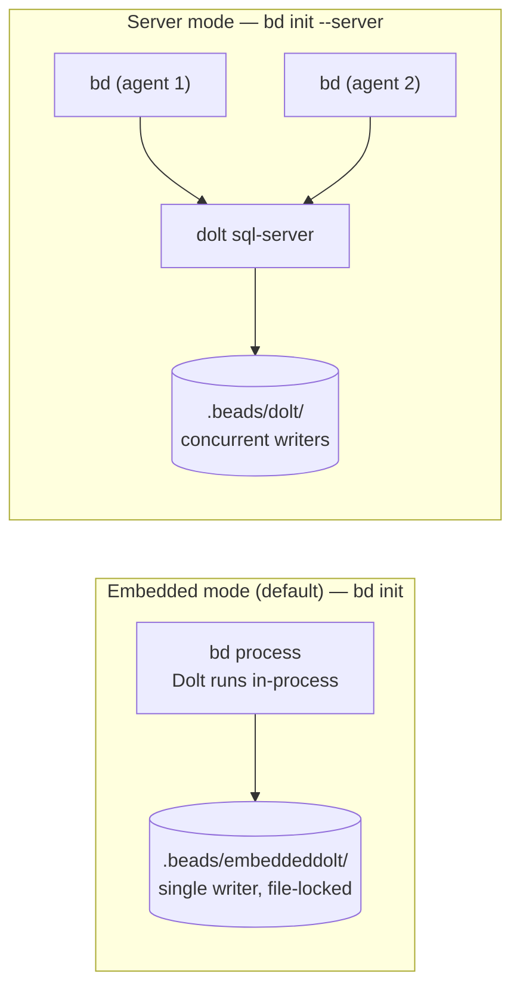

Dolt is Beads' default storage backend. It provides a version-controlled SQL
database with cell-level merge, native branching, and two deployment modes.
For the supported server-free SQLite alternative, see
[Storage Backends](/architecture/storage-backends).

## Why Dolt?

- **Native version control** — cell-level diffs and merges, not line-based
- **Multi-writer support** — server mode enables concurrent agents
- **Built-in history** — every write creates a Dolt commit
- **Native branching** — Dolt branches independent of git branches
- **Single-binary option** — embedded mode for solo users (no server needed)

## Getting Started

### Install Dolt (Server Mode Only)

Embedded mode includes everything in the `bd` binary; no separate Dolt install
is needed. Install the standalone `dolt` CLI only when you want to run server
mode or work directly with the database via `dolt sql`.

```bash
# macOS
brew install dolt

# Linux
curl -L https://github.com/dolthub/dolt/releases/latest/download/install.sh | bash

# Verify installation
dolt version
```

### New Project

```bash
# Embedded mode (single writer, no server — default for standalone)
bd init

# Server mode (multi-writer, e.g. orchestrator)
gt dolt start           # Start the Dolt server
bd init --server        # Initialize with server mode
```

### Migrate from Legacy SQLite Installations

Current releases support SQLite through the storage interface. This section is
only for upgrades from older, pre-Dolt SQLite schemas that are not compatible
with the current SQLite implementation.

> **Note:** The `bd migrate --to-dolt` command was removed in v0.58.0.
> For pre-0.50 installations with JSONL data, use the migration script:
>
> ```bash
> scripts/migrate-jsonl-to-dolt.sh
> ```
>
> See [Troubleshooting](/reference/troubleshooting#circuit-breaker-server-appears-down-failing-fast) if you encounter connection errors after migration.

Migration creates backups automatically. Your original SQLite database is preserved as `beads.backup-pre-dolt-*.db`.

## Modes of Operation



### Embedded Mode (Solo / Standalone)

In-process Dolt engine — no separate server needed. This is the default for
standalone Beads users. The `bd` binary includes everything; just `bd init` and go.

- Single-writer (one process at a time)
- Data lives in `.beads/embeddeddolt/` alongside your code
- Push to GitHub with `bd dolt push` — code and issues in one repo
- Zero ops: no server, no ports, no PID files

### Server Mode (Multi-Writer / Orchestrator)

Connects to a running `dolt sql-server` for multi-client access.

```bash
# Start the server (orchestrator)
gt dolt start

# Or manually
cd ~/.dolt-data/beads && dolt sql-server --port 3307
```

```bash
# Initialize in server mode
bd init --server

# Or switch via environment variable
export BEADS_DOLT_SERVER_MODE=1
```

```yaml
# .beads/config.yaml (server mode settings)
dolt:
  mode: server
  host: 127.0.0.1
  port: 3307
  user: root
```

Configure the connection with flags or environment variables:

| Flag | Env Var | Default |
|------|---------|---------|
| `--server-host` | `BEADS_DOLT_SERVER_HOST` | `127.0.0.1` |
| `--server-port` | `BEADS_DOLT_SERVER_PORT` | `3307` |
| `--server-socket` | `BEADS_DOLT_SERVER_SOCKET` | (none; uses TCP) |
| `--server-user` | `BEADS_DOLT_SERVER_USER` | `root` |
| | `BEADS_DOLT_PASSWORD` | (none) |

**Unix domain sockets:** Use `--server-socket` to connect via a Unix socket
instead of TCP. This avoids port conflicts between concurrent projects and is
useful in sandboxed environments (e.g., Claude Code) where file-level access
control is simpler than network allowlists. The Dolt server must be started
with `dolt sql-server --socket <path>`. Auto-start is not supported in socket
mode.

Switch to server mode when you need:
- Multiple agents writing simultaneously
- Orchestrator multi-rig setups
- Federation with remote peers

## Maintenance — `bd prune` and `bd purge`

`bd prune` permanently deletes closed non-ephemeral beads to reclaim storage
and shrink auto-exports. `bd purge` does the same for ephemeral beads (wisps,
transient molecules). Both require `--force` to execute.

```bash
bd prune --older-than 30d              # Preview closed beads >30d old
bd prune --older-than 30d --force      # Delete them
bd prune --older-than 90d --dry-run    # Detailed preview with stats
bd purge --force                       # Delete all closed ephemeral beads
```

**Reference-aware protection:** `bd prune` automatically skips closed beads
whose ID appears in the description, notes, or comments of any open or
in-progress bead. This prevents accidental deletion of ADR, decision, and
verification beads that downstream work still cites. Use
`--ignore-references` to override when cleaning up known-stale references:

```bash
bd prune --older-than 90d --ignore-references --force
```

`bd purge` is unaffected — ephemeral beads' references are themselves
transient. For full Dolt storage reclaim after deleting many rows, follow
with `bd flatten`.

## Migrating Between Backends

You can migrate data between embedded mode and server mode using `bd backup`.
Both directions preserve full Dolt commit history.

`bd export` is not a substitute for this flow. JSONL exports contain issue
records from the issues table for migration and interoperability; they do not
capture Dolt branches, full commit history, working-set state, or non-issue
tables. Use `bd backup` or a manual Dolt backup when you need a restorable
database backup.

### Server → Embedded

1. **Create a backup from the server-mode project:**

   ```bash
   # In the server-mode project directory
   bd backup init /path/to/backup-dir
   bd backup sync
   ```

2. **Create a new embedded-mode project and restore:**

   ```bash
   mkdir new-project && cd new-project
   bd init                  # creates an embedded-mode project by default
   bd backup restore --force /path/to/backup-dir
   ```

   `--force` overwrites the freshly-initialized database with the backup
   contents. The restore automatically:
   - Updates `metadata.json` to match the restored project identity
   - Registers the backup directory for future `bd backup sync`
   - Backfills the embedded migration tracker (`schema_migrations`)

3. **Verify:**

   ```bash
   bd list
   bd backup status
   ```

### Embedded → Server

1. **Create a backup from the embedded-mode project:**

   ```bash
   # In the embedded-mode project directory
   bd backup init /path/to/backup-dir
   bd backup sync
   ```

2. **Create a new server-mode project and restore:**

   ```bash
   mkdir new-project && cd new-project
   bd init --server         # creates a server-mode project
   bd backup restore --force /path/to/backup-dir
   ```

3. **Verify:**

   ```bash
   bd list
   bd backup status
   ```

### Backup Commands Reference

| Command | Description |
|---------|-------------|
| `bd backup init <path>` | Register a backup destination (filesystem or DoltHub URL) |
| `bd backup sync` | Push database to the configured backup destination |
| `bd backup restore [path]` | Restore from a backup directory (`--force` to overwrite) |
| `bd backup remove` | Unregister the backup destination |
| `bd backup status` | Show backup configuration and last sync time |

### Notes

- Data locations differ between modes: `.beads/embeddeddolt/` (embedded) vs `.beads/dolt/` (server)
- The backup directory is a full Dolt backup, not an `issues.jsonl` export — it can be on a local drive, NAS, or DoltHub
- You can also migrate via Dolt remotes (`bd dolt push` / `bd dolt pull`) if both projects share a remote

The sections below are the canonical backend migration reference.

## Federation (Peer-to-Peer Sync)

Federation lets independent Dolt-backed workspaces ("towns") sync issues
directly with each other via `bd federation add-peer`/`sync`/`status`,
without a central hub. Credentials are AES-256 encrypted and stored locally.

See [Federation Setup Guide](/multi-agent/federation) for the full setup guide, including
peer configuration, sovereignty tiers, sync/status/topology details, and
troubleshooting.

## Dolt Remotes

Use `bd dolt remote add` to configure remotes. This ensures the running Dolt SQL
server sees the remote immediately. Remotes added directly with the `dolt` CLI
are written to filesystem config and may not be visible to the server until
restart.

```bash
# DoltHub (public or private)
bd dolt remote add origin https://doltremoteapi.dolthub.com/org/beads

# S3
bd dolt remote add origin aws://[bucket]/path/to/repo

# GCS
bd dolt remote add origin gs://[bucket]/path/to/repo

# Git SSH (GitHub, GitLab, etc.)
bd dolt remote add origin git+ssh://git@github.com/org/repo.git

# Local file system
bd dolt remote add origin file:///path/to/remote
```

### Push/Pull

```bash
bd dolt push
bd dolt pull
```

`bd dolt remote add` registers the remote through the Dolt store API. SQL
remotes are the source of truth for `bd dolt remote list`, `bd dolt push`, and
`bd dolt pull`.

For git-protocol remotes, credentialed external-server remotes, and cloud
remotes whose credentials are only present in the current shell, `bd dolt push`
and `bd dolt pull` automatically materialize a matching local CLI remote before
using the `dolt` CLI transport. The CLI remote is a local transport mirror, not
a separate configuration source.

If you are upgrading from an older beads version and previously added remotes
with raw `dolt remote add`, re-register them with `bd dolt remote add <name>
<url>` so they are visible through SQL. `bd doctor` reports legacy CLI-only or
mismatched CLI remotes under `Dolt Remote Migration`.

> **Sharing a Git repo**: Dolt stores data under `refs/dolt/data`, separate
> from standard Git refs (`refs/heads/`, `refs/tags/`). You can safely point a
> `git+ssh://` remote at the same repository as your project source code. See
> [Dolt Git Remotes](https://docs.dolthub.com/concepts/dolt/git/remotes).

### List/Remove Remotes

```bash
bd dolt remote list            # Shows SQL-configured remotes
bd dolt remote remove origin   # Removes the remote
```

## Contributor Onboarding (Clone Bootstrap)

When someone clones a repository that uses Dolt backend:

1. Run `bd bootstrap` in the clone
2. If the git remote has `refs/dolt/data` (pushed via `bd dolt push`),
   `bd bootstrap` auto-detects it and clones the database from the remote
3. Work continues normally — all existing issues are available

**No manual steps required** beyond `bd bootstrap`. The auto-detect:
- Probes `origin` for `refs/dolt/data`
- Clones the Dolt database from the remote (instead of creating a fresh one)
- Configures the Dolt remote for future `bd dolt push`/`pull`

If `sync.remote` is set in `.beads/config.yaml`, that takes precedence
over auto-detection. Any Dolt-compatible remote URL is supported (DoltHub,
S3, GCS, file, or git). On brand-new projects, `bd init` auto-detects
`git origin` and persists it as `sync.remote`, so the first `bd dolt push`
publishes Dolt history to `refs/dolt/data` on the same git remote.

### Verifying Bootstrap Worked

```bash
bd list              # Should show issues
bd vc status         # Should show the current branch, no uncommitted changes
```

## Troubleshooting

### Server Not Running

**Symptom:** Connection refused errors when using server mode.

```
failed to create database: dial tcp 127.0.0.1:3307: connect: connection refused
```

**Fix:**
```bash
gt dolt start        # Orchestrator command
# Or
gt dolt status       # Check if running
```

### Bootstrap Not Running

**Symptom:** `bd list` shows nothing on fresh clone.

**Check:**
```bash
ls .beads/dolt/            # Should NOT exist (pre-bootstrap)
BD_DEBUG=1 bd list         # See bootstrap output
```

**Force bootstrap:**
```bash
rm -rf .beads/dolt         # Remove broken state
bd list                    # Re-triggers bootstrap
```

### Database Corruption

**Symptom:** Queries fail, inconsistent data.

**Diagnosis:**
```bash
bd doctor                  # Basic checks
bd doctor --deep           # Full validation
bd doctor --server         # Server mode checks (if applicable)
```

**Recovery options:**

1. **Repair what's fixable:**
   ```bash
   bd doctor --fix
   ```

2. **Rebuild from remote:**
   ```bash
   rm -rf .beads/dolt
   bd list                  # Re-triggers bootstrap
   ```

### Already Committed `.beads/dolt/` to Git

If you accidentally committed a Dolt data directory:

1. Update gitignore: `bd doctor --fix`
2. Remove it from git tracking: `git rm --cached -r .beads/dolt/` (or `.beads/embeddeddolt/`)
3. Commit the removal: `git commit -m "fix: remove accidentally committed dolt data"`
4. To purge from history, use [BFG Repo-Cleaner](https://rtyley.github.io/bfg-repo-cleaner/) or `git filter-repo`

### Lock Contention (Embedded Mode)

**Symptom:** "database is locked" errors.

Embedded mode is single-writer (enforced via file lock). If you need concurrent
access, switch to server mode. See [Migrating Between Backends](#migrating-between-backends).

## Configuration Reference

```yaml
# .beads/config.yaml

# Dolt settings
dolt:
  # Auto-commit Dolt history after writes (default: on for embedded, off for server)
  auto-commit: on        # on | off

  # Storage mode (default: embedded)
  mode: embedded         # embedded | server
  # Server mode settings (only used when mode: server)
  host: 127.0.0.1
  port: 3307
  user: root
  # Password: env var or credentials file (see below)

  # Shared server mode (GH#2377): all projects share a single Dolt server
  # at ~/.beads/shared-server/. Each project uses its own database (prefix-based).
  # Eliminates port conflicts and reduces resource usage on multi-project machines.
  shared-server: false   # true | false
```

### Environment Variables

| Variable | Purpose |
|----------|---------|
| `BEADS_DOLT_PASSWORD` | Server mode password (highest priority) |
| `BEADS_DOLT_CREDENTIAL_COMMAND` | Gateway identity command (token becomes the connection username) |
| `BEADS_CREDENTIALS_FILE` | Path to credentials file (overrides default location) |
| `BEADS_DOLT_SERVER_MODE` | Enable server mode (set to "1") |
| `BEADS_DOLT_SERVER_HOST` | Server host (default: 127.0.0.1) |
| `BEADS_DOLT_SERVER_PORT` | Server port (default: 3307, or 3308 in shared mode) |
| `BEADS_DOLT_SERVER_TLS` | Enable TLS (set to "1" or "true") |
| `BEADS_DOLT_SERVER_USER` | MySQL connection user |
| `BEADS_DOLT_SHARED_SERVER` | Enable shared server mode (set to "1" or "true") |
| `DOLT_REMOTE_USER` | Clone/push/pull auth user |
| `DOLT_REMOTE_PASSWORD` | Clone/push/pull auth password |
| `BD_DOLT_AUTO_COMMIT` | Override auto-commit setting |

### Gateway Identity Credentials

Authenticating gateway deployments can set
`BEADS_DOLT_CREDENTIAL_COMMAND` to a command that mints a short-lived identity
token. Beads runs the command, reads a bare token or supported JSON token
envelope from stdout, and presents that token as the MySQL connection username.
The gateway verifies the identity and routes the connection to the appropriate
Dolt database.

This is an identity credential, not a database password:

- A server user already preset by the opener takes precedence. Otherwise the
  command runs before the static `BEADS_DOLT_SERVER_USER` or metadata user.
- A configured command that fails aborts the connection. Beads does not fall
  back to the static `root` user.
- The command is read from the environment only and is never persisted in
  workspace metadata.
- Gateway mode assumes an externally managed server, so Beads does not
  auto-start a local `dolt sql-server`.
- Tokens containing `:`, `@`, or `/` are rejected because the MySQL DSN grammar
  cannot represent them safely in the username field.

For ordinary Dolt server deployments, use `BEADS_DOLT_PASSWORD` or the
credentials file below instead.

### Credentials File

For multi-server setups, you can store passwords in an INI-style credentials file
instead of juggling environment variables per project. Passwords are looked up by
`[host:port]` section, so each project automatically gets the right password based
on its configured server.

**Password resolution order:**
1. `BEADS_DOLT_PASSWORD` env var (highest priority, existing behavior)
2. Credentials file lookup by `[host:port]` (using the resolved runtime port)
3. Empty string (no password)

**Port resolution note:** The `[host:port]` used for credential lookup matches the
resolved runtime port (from the port file, env var, or config — in that priority
order), not necessarily the port stored in `metadata.json`. This matters when using
IAP tunnels: if your tunnel maps remote:3307 to localhost:3308, store your password
under `[127.0.0.1:3308]` and the credentials file will match the actual connection.

**Default location:** `~/.config/beads/credentials` (Linux/macOS), `%APPDATA%\beads\credentials` (Windows)

**Override location:** Set `BEADS_CREDENTIALS_FILE` env var.

**File format:**

```ini
# ~/.config/beads/credentials
[127.0.0.1:3307]
password=localDevPassword

[beads.company.com:3307]
password=teamServerPassword

[10.0.1.50:3308]
password=officePassword
```

**Permissions:** On Linux/macOS, a warning is printed to stderr if the file is
readable by group or others (mirrors ssh behavior). Set permissions with:

```bash
chmod 600 ~/.config/beads/credentials
```

## Dolt Version Control

Dolt maintains its own version history, separate from Git:

```bash
# View an issue's version history across Dolt commits
bd history bd-42

# Show current branch and uncommitted changes
bd vc status

# Create manual checkpoint
bd vc commit -m "Checkpoint before refactor"
```

### Auto-Commit Behavior

In **embedded mode** (standalone default), each `bd` write command creates a Dolt commit:

```bash
bd create "New issue"    # Creates issue + Dolt commit
```

In **server mode** (orchestrator), auto-commit defaults to OFF because the server
manages its own transaction lifecycle. Firing `DOLT_COMMIT` after every write
under concurrent load causes 'database is read only' errors.

Override for batch operations (embedded) or explicit commits (server):

```bash
bd --dolt-auto-commit off create "Issue 1"
bd --dolt-auto-commit off create "Issue 2"
bd vc commit -m "Batch: created issues"
```

## Server Management (Orchestrator)

The orchestrator provides integrated Dolt server management:

```bash
gt dolt start            # Start server (background)
gt dolt stop             # Stop server
gt dolt status           # Show server status
gt dolt logs             # View server logs
gt dolt sql              # Open SQL shell
```

Server runs on port 3307 (avoids MySQL conflict on 3306).

### Standalone-to-managed-city handoff

When an existing standalone project is later added to a managed city or
orchestrator, avoid letting two Dolt servers become sources of truth for the
same beads database name. A common split-brain symptom is that `.beads/dolt-server.port`
points at the old standalone server while the shell environment points `bd` at
the managed server with `BEADS_DOLT_PORT` or `BEADS_DOLT_SERVER_PORT`.

Check before migrating:

```bash
bd doctor
bd dolt status
```

`bd doctor` warns when the runtime managed port differs from the local port
file. The warning is intentionally diagnostic only; do not delete the local port
file until the standalone store has been exported and imported into the managed
server.

Safe manual handoff:

```bash
# From the standalone project, without managed-city port overrides:
unset BEADS_DOLT_PORT BEADS_DOLT_SERVER_PORT
bd backup
bd export > /tmp/beads-standalone.jsonl
bd dolt stop

# Then enter the managed-city environment and import into its Dolt server:
bd import /tmp/beads-standalone.jsonl
bd doctor
```

After `bd doctor` shows one healthy store and the imported issue count is
correct, archive the old local Dolt data directory instead of deleting it
immediately. Keep the backup until the managed city has been pushed or otherwise
snapshotted.

### Shared Server Mode

On machines with multiple beads projects, each project normally starts its own Dolt server.
Shared server mode runs a single Dolt server at `~/.beads/shared-server/` that serves all projects:

```bash
# Enable for this project (config.yaml key)
bd config set dolt.shared-server true

# Or enable machine-wide via environment variable
export BEADS_DOLT_SHARED_SERVER=1

# Or enable during init
bd init --prefix myproject --shared-server
```

**Benefits:**
- No port conflicts between projects (single server on port 3308, avoids orchestrator on 3307)
- Reduced resource usage (one process instead of many)
- Automatic database isolation (each project uses its own database name)

**How it works:**
- Server state files (PID, port, lock, log) live in `~/.beads/shared-server/`
- Dolt data directory: `~/.beads/shared-server/dolt/`
- Each project's database is stored as a subdirectory (e.g., `~/.beads/shared-server/dolt/myproject/`)
- The file lock mechanism ensures safe concurrent access from multiple projects
- Default port is 3308 (not 3307) to avoid conflict with the orchestrator. Override with `BEADS_DOLT_SERVER_PORT` or `dolt.port` in config.yaml

**Important:** Each project on a shared server **must have a unique prefix** (database name).
Two projects with the same prefix share the same database — if this happens accidentally,
the project identity check will detect the mismatch and refuse to connect, preventing
silent data corruption. Always use distinct prefixes when running `bd init --shared-server`.

```bash
# Check shared server status from any project
bd dolt status

# Show full configuration including shared mode
bd dolt show
```

### Data Location (Orchestrator)

```
<town-root>/.dolt-data/
├── hq/                  # Town beads (hq-*)
├── my-project/          # Project rig (mp-*)
├── beads/               # Beads rig (bd-*)
└── other-project/       # Other rig (op-*)
```

### Central Dolt Server (macOS LaunchAgent)

If you do not use the orchestrator but still want a single persistent Dolt
server for multiple projects on macOS, run a custom `LaunchAgent` instead of
spawning per-project embedded instances.

#### Why Not `brew services start dolt`?

After installing Dolt with `brew install dolt`, the natural next step is
`brew services start dolt`. However, the Homebrew formula runs
`dolt sql-server` without the `--config` flag, and Dolt does not auto-discover
`config.yaml` from its working directory. The config file must be passed
explicitly with `--config <file>`.

#### Setup with a Custom LaunchAgent

Install Dolt and initialize its data directory:

```bash
brew install dolt
cd /opt/homebrew/var/dolt && dolt init
```

Configure Dolt for port 3307:

```yaml
# /opt/homebrew/var/dolt/config.yaml
log_level: info

listener:
  host: 127.0.0.1
  port: 3307
  max_connections: 100

behavior:
  autocommit: true
```

Create the LaunchAgent plist:

```bash
cat > ~/Library/LaunchAgents/com.local.dolt-server.plist << 'EOF'
<?xml version="1.0" encoding="UTF-8"?>
<!DOCTYPE plist PUBLIC "-//Apple//DTD PLIST 1.0//EN"
  "http://www.apple.com/DTDs/PropertyList-1.0.dtd">
<plist version="1.0">
<dict>
    <key>Label</key>
    <string>com.local.dolt-server</string>
    <key>ProgramArguments</key>
    <array>
        <string>/opt/homebrew/bin/dolt</string>
        <string>sql-server</string>
        <string>--config</string>
        <string>/opt/homebrew/var/dolt/config.yaml</string>
    </array>
    <key>WorkingDirectory</key>
    <string>/opt/homebrew/var/dolt</string>
    <key>RunAtLoad</key>
    <true/>
    <key>KeepAlive</key>
    <true/>
    <key>StandardOutPath</key>
    <string>/opt/homebrew/var/log/dolt.log</string>
    <key>StandardErrorPath</key>
    <string>/opt/homebrew/var/log/dolt-error.log</string>
</dict>
</plist>
EOF
```

Load and verify the service:

```bash
launchctl load ~/Library/LaunchAgents/com.local.dolt-server.plist
mysql -h 127.0.0.1 -P 3307 -u root -e "SELECT 1"
```

Point beads at the central server:

```bash
export BEADS_DOLT_SERVER_MODE=1
export BEADS_DOLT_SERVER_PORT=3307
```

Manage the service:

```bash
# Stop
launchctl unload ~/Library/LaunchAgents/com.local.dolt-server.plist

# Restart
launchctl unload ~/Library/LaunchAgents/com.local.dolt-server.plist
launchctl load ~/Library/LaunchAgents/com.local.dolt-server.plist

# Check logs
tail -f /opt/homebrew/var/log/dolt.log
```

## Advanced Dolt Usage

The `dolt` CLI lets you operate directly on the database for power-user
workflows. The data directory depends on your mode: `.beads/embeddeddolt/`
(embedded) or `.beads/dolt/` (server).

### Branching

```bash
cd .beads/dolt   # or .beads/embeddeddolt for embedded mode
dolt branch feature-x
dolt checkout feature-x
```

### Time Travel

```bash
dolt log
dolt checkout <commit-hash>
dolt sql -q "SELECT * FROM issues"
```

### Diff and Blame

```bash
dolt diff main feature-x
dolt blame issues
```

## Migration Cleanup

After successful migration from SQLite, you may have backup files:

```
.beads/beads.backup-pre-dolt-20260122-213600.db
.beads/sqlite.backup-pre-dolt-20260123-192812.db
```

These are safe to delete once you've verified Dolt is working:

```bash
# Verify Dolt works
bd list
bd doctor

# Then clean up (after appropriate waiting period)
rm .beads/*.backup-*.db
```

**Recommendation:** Keep backups for at least a week before deleting.

## See Also

- [Sync Concepts](/core-concepts/sync-concepts) - The conceptual model behind cross-machine sync (Dolt source of truth, wire format, anti-patterns)
- [Sync Setup Guide](/getting-started/sync-setup) - Setting up sync across multiple computers
- [Federation Setup Guide](/multi-agent/federation) - Peer-to-peer federation setup
- [Configuration](/reference/configuration) - Full configuration reference
- [Dependencies and Gates](/core-concepts/dependencies) - Dependencies and gates
- [Git Integration](/reference/git-integration) - Git worktrees and protected branches
- [Troubleshooting](/reference/troubleshooting) - General troubleshooting
