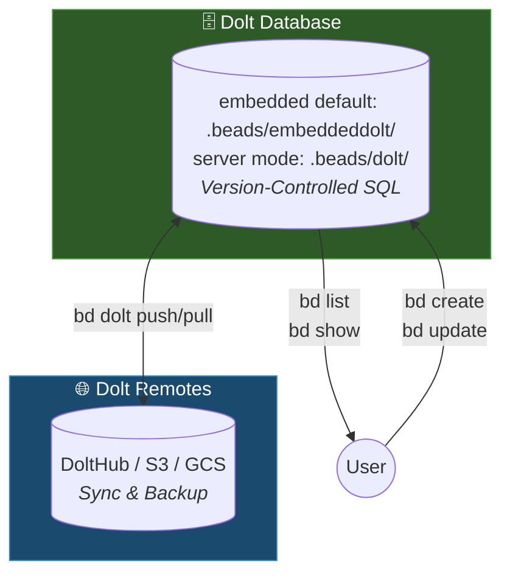

This document explains how Beads' architecture works with Dolt as its storage backend: the storage layout, the data model, and the sync paths. For the concept model — beads, dependencies, ready work, molecules — see [How Beads Works](/core-concepts/index).

## Architecture

Beads uses **Dolt** as its sole storage backend -- a version-controlled SQL database that provides git-like semantics (branch, merge, diff, push, pull) natively at the database level.

By default, Dolt runs in **embedded mode** (in-process, no separate server). For multi-writer
setups (multiple agents, orchestrator), switch to **server mode** which connects to a
running `dolt sql-server`. See the [Dolt Server Mode](#dolt-server-mode) section below for details.



<Info>
**Source of Truth**
**Dolt** is the source of truth. Every write auto-commits to Dolt history, providing full version control, branching, and merge capabilities at the database level.

Recovery is straightforward: pull from a Dolt remote with `bd dolt pull`, or restore from a Dolt-native backup with `bd backup restore`.
</Info>

### Why Dolt?

- **Version-controlled SQL**: Full SQL queries with native version control
- **Cell-level merge**: Concurrent changes merge automatically at the field level
- **Multi-writer**: Server mode supports concurrent agents
- **Native branching**: Dolt branches independent of git branches
- **Works offline**: All queries run against local database
- **Portable**: `bd export` produces JSONL for migration and interoperability

## Data Model

The database stores five kinds of records: issues (the beads themselves), dependencies (typed edges such as `blocks`, `parent-child`, `related`, and `discovered-from`), labels, comments, and events (the audit trail). What each means — and how `bd ready` computes the claimable frontier from them — is covered in [How Beads Works](/core-concepts/index).

Issue IDs are content-derived hashes (`bd-a1b2`) so that concurrent writers never collide and no central ID coordination is needed. See [Hash-based IDs](/core-concepts/hash-ids) for the design and [COLLISION_MATH](https://github.com/gastownhall/beads/blob/main/engdocs/COLLISION_MATH.md) for the birthday-paradox analysis of hash length vs collision probability.

### Issue Schema

Core fields on every issue, as stored in Dolt and emitted in `bd export` JSONL. Optional fields are omitted when empty.

| Field | Type | Description |
|-------|------|-------------|
| `id` | string | Unique hash ID (e.g., `bd-a1b2`) |
| `title` | string | Issue title (required) |
| `description` | string | Detailed description (optional) |
| `design` | string | Design notes (optional) |
| `acceptance_criteria` | string | Acceptance criteria (optional) |
| `notes` | string | Additional notes (optional) |
| `status` | string | `open`, `in_progress`, `blocked`, `deferred`, `closed`, `pinned`, `hooked` (defaults to `open`; extendable via the `status.custom` config key) |
| `priority` | int | 0–4, where 0 = critical and 4 = backlog |
| `issue_type` | string | `bug`, `feature`, `task`, `epic`, `chore`, `decision`, `message`, `molecule`, `gate`, `spike`, `story`, `milestone` (defaults to `task`) |
| `assignee` | string | Assigned user/agent (optional) |
| `estimated_minutes` | int | Time estimate in minutes (optional) |
| `created_at` / `updated_at` | RFC3339 | Creation and last-modification times |
| `created_by` | string | Who created the issue (optional) |
| `closed_at` / `close_reason` | RFC3339 / string | Set when the issue is closed (optional) |
| `external_ref` | string | External reference such as `gh-9` or `jira-ABC` (optional) |
| `metadata` | JSON | Arbitrary extension data — see [Issue Metadata](/core-concepts/metadata) |
| `labels` | []string | Tags attached to the issue (optional) |
| `dependencies` | []Dependency | Typed edges to other issues (optional) |
| `comments` | []Comment | Discussion thread (optional) |

Issues also carry workflow-layer field groups, among others: scheduling (`due_at`, `defer_until`), claim leasing (`lease_expires_at`, `heartbeat_at`), gates (`await_type`, `await_id`, `timeout`), and molecule/wisp fields (`ephemeral`, `mol_type`, `bonded_from`).

Internal fields — `content_hash` (a SHA-256 of the issue's canonical content, used for change detection), `source_repo`, and `id_prefix` — never appear in exports.

The schema is stable by default: prefer the `metadata` field for integration-, orchestrator-, or team-specific data before proposing new first-class fields. See the [Project Charter's schema boundary](https://github.com/gastownhall/beads/blob/main/engdocs/PROJECT_CHARTER.md#schema-boundary).

## Data Flow

### Write Path
```text
User runs bd create
    → Dolt database updated
    → Auto-committed to Dolt history
```

### Read Path
```text
User runs bd list
    → Dolt SQL query
    → Results returned immediately
```

### Sync Path
```text
User runs bd dolt push
    → Commits pushed to Dolt remote

User runs bd dolt pull
    → Remote commits fetched and merged
```

Dolt remotes can live on DoltHub, S3, GCS, a filesystem path, or your existing git remote — issue history rides under `refs/dolt/data`, separate from code branches. See [Sync Concepts](/core-concepts/sync-concepts) for the wire format and setup.

Cross-repo setups can also exchange beads peer-to-peer via [federation](/multi-agent/federation). Ephemeral [wisps](/workflows/wisps) are excluded from federation push by default, so execution traces never enter shared history.

### Multi-Machine Sync Considerations

When working across multiple machines or clones:

1. **Always sync before switching machines**
   ```bash
   bd dolt push  # Push changes before leaving
   ```

2. **Pull before creating new issues**
   ```bash
   bd dolt pull  # Pull changes first on new machine
   bd create "New issue"
   ```

3. **Avoid parallel edits** - If two machines create issues simultaneously without syncing, Dolt's cell-level merge handles most conflicts automatically

See [Sync Failures Recovery](/recovery/sync-failures) for data loss prevention in multi-machine workflows (Pattern A5/C3).

## Dolt Server Mode

The Dolt server handles background synchronization and database operations:

- Manages the Dolt database backend
- Handles auto-commit for change tracking
- Provides concurrent access for multiple agents
- Runtime files live directly in `.beads/`: `dolt-server.pid`, `dolt-server.log`, and `dolt-server.port`

An opt-in *shared server* mode runs a single Dolt server at `~/.beads/shared-server/` for all projects, enabled with `dolt.shared-server: true` in `config.yaml` or `BEADS_DOLT_SHARED_SERVER=1` — see [Dolt Backend](/architecture/dolt#shared-server-mode).

<Tip>
Start the Dolt server with `bd dolt start`. Check health with `bd doctor`.
</Tip>

### Embedded Mode (No Server)

Embedded mode is the default (`bd init` with no flags): Dolt runs in-process, single-writer, with data at `.beads/embeddeddolt/` — no server process and no separate Dolt install. Server mode is opt-in via `bd init --server`; the choice is persisted in `.beads/metadata.json`.

```bash
bd create "CI-generated issue"
bd dolt push
```

**Beyond solo use, embedded mode is a natural fit for:**
- CI/CD pipelines (Jenkins, GitHub Actions)
- Docker containers
- Ephemeral environments
- Scripts that should not leave background processes

### Multi-Clone Scenarios

<Warning>
**Race Conditions in Multi-Clone Workflows**
When multiple git clones of the same repository run sync operations simultaneously, race conditions can occur during push/pull operations. This is particularly common in:
- Multi-agent AI workflows (multiple Claude/GPT instances)
- Developer workstations with multiple checkouts
- Worktree-based development workflows

**Prevention:**
1. Stop the Dolt server (`bd dolt stop`) before switching between clones
2. Dolt handles worktrees natively in server mode
3. Use embedded mode for automated workflows
</Warning>

See [Sync Failures Recovery](/recovery/sync-failures) for sync race condition troubleshooting (Pattern B2).

## Directory Layout

```text
.beads/
├── embeddeddolt/     # Dolt database (embedded mode, default) — gitignored
├── dolt/             # Dolt database (server mode) — gitignored
├── dolt-server.pid   # Server-mode runtime files (.pid, .log, .port) — gitignored
├── issues.jsonl      # Passive JSONL export for viewers and interchange
├── metadata.json     # Backend config — tracked in git
└── config.yaml       # Project config (optional) — tracked in git
```

The database directory for your mode is the only thing holding issue data; everything else is configuration, runtime state, or a derived export. `bd init` writes a `.beads/.gitignore` that keeps the database and runtime files out of git.

## Recovery Model

Dolt's version control makes recovery straightforward:

1. **Lost database?** → Pull from Dolt remote: `bd dolt pull`
2. **Have a backup?** → Restore it: `bd backup restore [path] --force`
3. **Merge conflicts?** → Dolt handles cell-level merge natively

Create backups with `bd backup init` (a filesystem path or DoltHub destination) and push them with `bd backup sync`. Dolt-native backups preserve full commit history; a JSONL export does not.

### Universal Recovery Sequence

The following sequence resolves the majority of reported issues. For detailed procedures, see [Recovery Runbooks](/recovery/index).

```bash
bd dolt stop                 # Stop Dolt server (prevents race conditions)
git worktree prune           # Clean orphaned worktrees
bd dolt pull                 # Pull from Dolt remote
bd dolt start                # Restart server
```

<Warning>
**Use `bd doctor --fix` With Care**
Always back up and preview before running `bd doctor --fix`:

1. **Back up first:** `cp -r .beads .beads.backup`
2. **Preview changes:** `bd doctor --dry-run` — shows what would be fixed without making changes
3. **Review diagnostics:** `bd doctor` (no flags) — diagnostic only, no changes made
4. **Then fix:** `bd doctor --fix` — or `bd doctor --fix -i` to confirm each fix individually

**Why caution?** The `--fix` flag may remove dependencies it flags as circular, including valid parent-child relationships. Use `--fix-child-parent` only if you're certain the flagged deps are invalid.

**Other diagnostic tools:**
- `bd blocked` — check which issues are blocked and why
- `bd show <issue-id>` — inspect a specific issue's state
</Warning>

See [Recovery](/recovery/index) for specific procedures and [Database Corruption Recovery](/recovery/database-corruption) for Dolt recovery steps.

## Design Decisions

### Why Dolt?

Dolt is a version-controlled SQL database that provides git-like semantics natively. Unlike plain SQLite (binary merge conflicts) or JSONL (slow queries), Dolt gives you both fast SQL queries and proper merge semantics.

### Why not a cloud server?

Beads is designed for offline-first, local-first development. The Dolt server runs locally -- no cloud dependency, no downtime, no vendor lock-in, and full functionality on airplanes or in restricted networks.

### Trade-offs

| Benefit | Trade-off |
|---------|-----------|
| Works offline | No real-time collaboration |
| Version-controlled database | Server mode needed for concurrent writers |
| Cell-level merge | Requires initial setup |
| Local-first speed | Manual sync to remotes |
| SQL queries | Dolt storage engine dependency |

### When NOT to use Beads

Beads is not suitable for:

- **Large teams (10+)** — Git-based sync doesn't scale well for high-frequency concurrent edits
- **Non-developers** — Requires Git and command-line familiarity
- **Real-time collaboration** — No live updates; requires explicit sync
- **Rich media attachments** — Designed for text-based issue tracking

For these use cases, consider GitHub Issues, Linear, or Jira.

## Related Documentation

- [How Beads Works](/core-concepts/index) — The concept model: beads, dependencies, ready work, molecules
- [Sync Concepts](/core-concepts/sync-concepts) — Cross-machine sync, wire format, and anti-patterns
- [Dolt Backend](/architecture/dolt) — Embedded vs server mode in depth, shared server, migration
- [Recovery Runbooks](/recovery/index) — Step-by-step procedures for common issues
- [CLI Reference](/cli-reference/index) — Complete command documentation
- [Getting Started](/index) — Installation and first steps
- [Project Charter](https://github.com/gastownhall/beads/blob/main/engdocs/PROJECT_CHARTER.md) — Product scope and boundaries (contributor doc)
- [Internals](https://github.com/gastownhall/beads/blob/main/engdocs/INTERNALS.md) — Implementation details (contributor doc)
