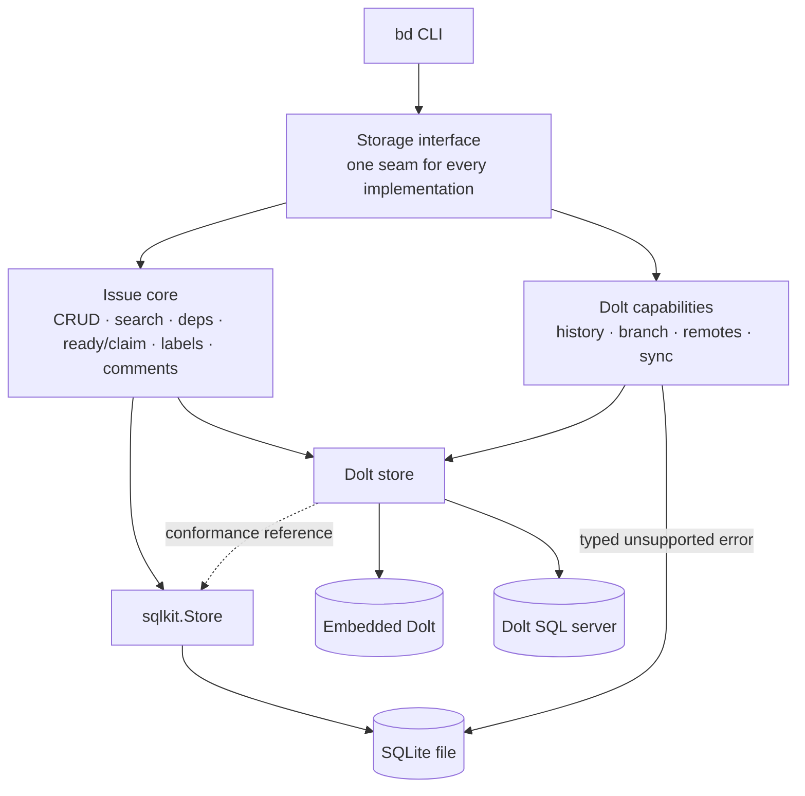

Beads keeps issue storage behind one interface and supports three deployment
paths:

- **Embedded Dolt (default)** — version-controlled storage in the `bd` process
- **Dolt server** — the same version-controlled storage through a
  `dolt sql-server`, for concurrent writers
- **SQLite** — a small, server-free database file for local and resource-light
  workspaces

The issue-tracking semantics are written once in the shared core. Dolt is the
reference implementation and adds history, branching, remotes, and sync.
SQLite runs the same issue core through the SQL adapter and returns a clear,
typed error for operations that require Dolt's commit graph.



<Accordion title="Plain-text version of the diagram">

```text
                              bd CLI
                                |
                       Storage interface
                                |
             +------------------+------------------+
             |                                     |
         Issue core                       Dolt capabilities
   CRUD, search, deps, claims,          history, branch, remotes,
   labels, comments, ordering                    sync
             |                                     |
      +------+-------+                             |
      |              |                             |
  Dolt store     sqlkit.Store <--- conformance ----+
      |              |
  +---+---+        SQLite file
  |       |        (typed unsupported errors for
embedded  server    Dolt-only capabilities)
 Dolt     Dolt
```

</Accordion>

## Supported Scope

The recently added direct PostgreSQL and MySQL adapters have been rolled back.
Supporting additional general-purpose server databases adds dialect,
credential, schema-lifecycle, migration, CI, and operational complexity. Our
goal is to keep Beads as simple as possible and consume as few resources as
possible, so the supported implementations stay focused on Dolt and SQLite.

This does **not** remove Dolt server mode. A `dolt sql-server` speaks the MySQL
wire protocol, and Beads continues to support that mode for concurrent writers.
A MySQL-protocol reference in the Dolt documentation therefore describes a
Dolt connection, not a generic MySQL storage backend.

## Choose a Storage Path

| Storage path | Best for | History and sync | Concurrent writers | Server or credentials |
|---|---|---|---|---|
| Embedded Dolt (default) | Most projects; offline-first work with versioned issue data | Yes | One process at a time | None |
| Dolt server | Teams or orchestrators with multiple writers | Yes | Yes | `dolt sql-server`; credentials when configured |
| SQLite | Local work, CI sandboxes, air-gapped or minimal-footprint environments | No | Writes are serialized | None |

Rules of thumb:

- Use **embedded Dolt** unless you have a reason to choose differently.
- Use **Dolt server** when multiple processes need to write concurrently.
- Use **SQLite** when the smallest server-free footprint matters more than
  history, branching, federation, or cross-machine sync.

## Getting Started

The backend is selected at `bd init` time and recorded in
`.beads/metadata.json`. Later commands reopen that implementation
automatically.

### Embedded Dolt (default)

```bash
bd init --prefix myproj
```

Dolt runs in-process and stores data under `.beads/embeddeddolt/`. No separate
server or credentials are needed.

### Dolt server

```bash
bd init --server --prefix myproj
```

Server mode connects to a `dolt sql-server`. Managed repo-local mode stores
data under `.beads/dolt/`; shared, external, and gateway servers manage their
own data locations. See [Dolt Backend for Beads](/architecture/dolt) for
managed, shared, external, socket, TLS, and credential configuration.

### SQLite

```bash
bd init --backend=sqlite --prefix myproj

# Optional: choose the database file (relative to .beads/; default beads.db)
bd init --backend=sqlite --sqlite-path=issues.db --prefix myproj
```

SQLite needs no server and no credentials. Foreign keys and transaction
locking are configured automatically.

## Credentials

Embedded Dolt and SQLite need no database credentials. Dolt server mode can
use `BEADS_DOLT_PASSWORD` or the per-host credentials file documented in the
[Dolt backend guide](/architecture/dolt#credentials-file).

Authenticating gateway deployments can instead set
`BEADS_DOLT_CREDENTIAL_COMMAND`. The command produces a short-lived identity
token that Beads presents as the connection username to the gateway. This is a
Dolt server feature; see
[Gateway identity credentials](/architecture/dolt#gateway-identity-credentials)
for the fail-closed behavior and precedence rules.

## Existing PostgreSQL or MySQL Workspaces

Current Beads builds still recognize PostgreSQL and MySQL workspace markers so
they can stop safely with migration guidance. They do not connect to, open, or
modify the configured PostgreSQL or MySQL database.

To move an existing workspace:

1. Leave the original server database and workspace metadata in place. Take a
   server-native backup before making changes.
2. Before upgrading, or with a separate `bd` build that supports the configured
   backend, create an issue export:

   ```bash
   bd export --all -o beads-export.jsonl
   ```

3. Install the current build and follow `bd help init-safety` before
   reinitializing the workspace with embedded Dolt, Dolt server, or SQLite.
4. Import the issue export and verify the resulting workspace:

   ```bash
   bd import beads-export.jsonl
   ```

5. Keep the original server database until the imported workspace has been
   checked and backed up using its new storage path.

Do not edit `.beads/metadata.json` to point at another backend. JSONL is an
issue-level interchange format, not a complete database backup, and does not
replace the server-native backup from step 1.

## What SQLite Keeps and What It Gives Up

SQLite implements the complete issue-tracking core:

- Issue CRUD, bulk creates, close, reopen, and delete
- Search, counts, filtering, and sorting
- Dependencies, cycle detection, and dependency trees
- Ready and blocked queries, claims, and leases
- Labels, comments, events, config, metadata, and statistics
- Transactions and streaming iterators

Operations built on Dolt's version-control capabilities remain Dolt-only:

- **History and time travel** — `bd history`, as-of queries, and diffs
- **Branching and merging** — branch, checkout, merge, and conflict resolution
- **Remotes and sync** — `bd dolt push`, `bd dolt pull`, fetch, and sync
- **Federation** — peer management
- **Compaction** — snapshot-based memory compaction

Those operations fail explicitly on SQLite instead of approximating Dolt
behavior:

```text
$ bd history myproj-9q9
Error: failed to get history: operation "History" not supported by the sqlite backend
```

`bd init` also sets the expectation up front:

```text
✓ bd initialized with the SQLite backend
  History: not tracked (SQLite backend has no version control; use Dolt for history)
```

SQLite writes are durable when the command returns. The Dolt-only maintenance
tail—history commits, native backups, and remote pushes—is skipped. Use
`bd export` when you need a portable JSONL copy of issue data; JSONL remains an
interchange format rather than a full database backup.

## How Conformance Is Enforced

The conformance harness holds SQLite to the embedded-Dolt reference:

- **Tier 1 (in-process)** runs the same issue-store behavior corpus against
  embedded Dolt and SQLite, including the typed-unsupported contract for
  Dolt-only operations.
- **Tier 2 (end-to-end)** builds a real `bd` binary, initializes isolated Dolt
  and SQLite workspaces, and compares normalized CLI output.

Run both tiers with:

```bash
./scripts/conformance.sh
```

See [Dolt Backend for Beads](/architecture/dolt) for versioned storage and
[Configuration](/reference/configuration) for settings shared across storage
paths.
