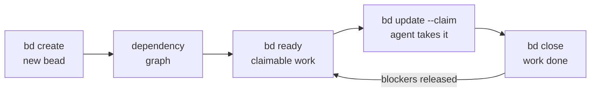
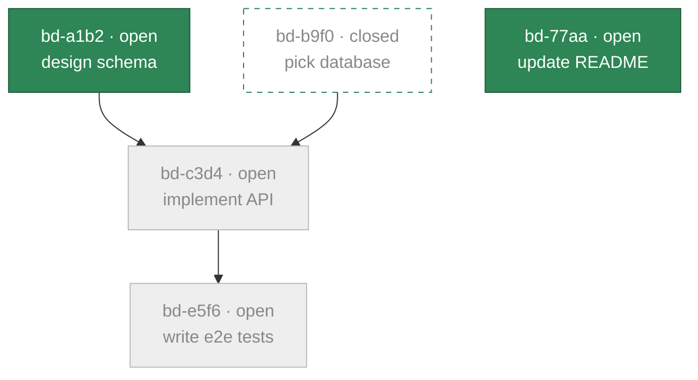
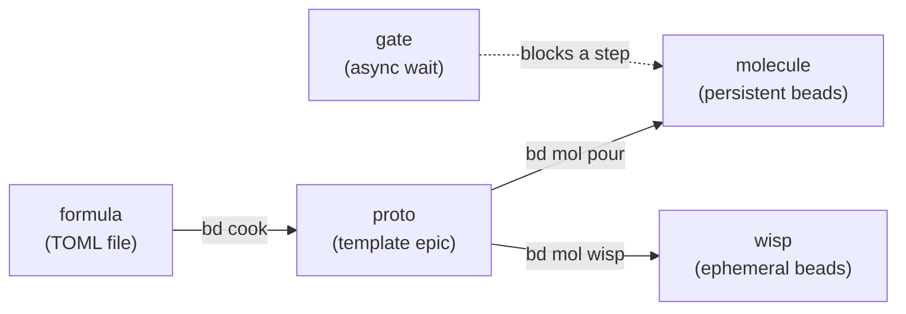
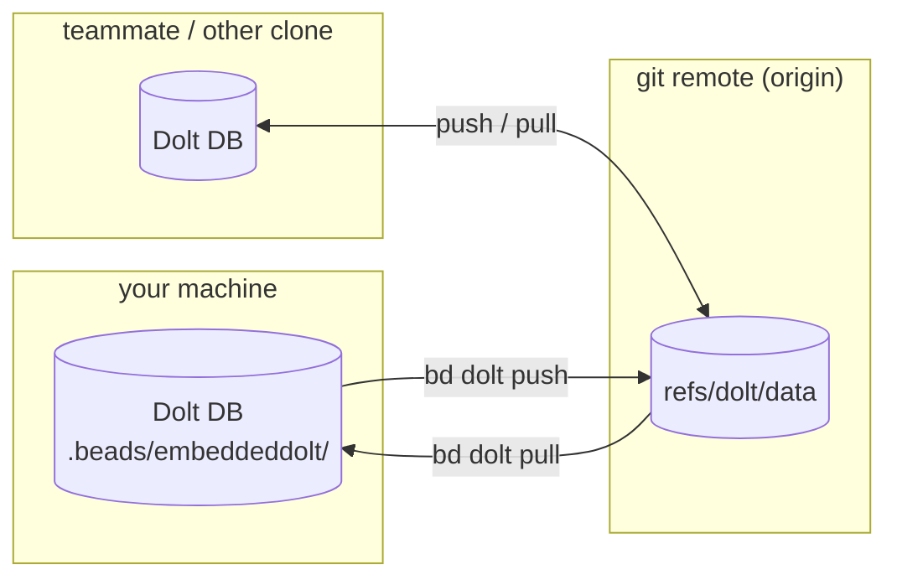

Coding agents lose their memory every time a session ends. Markdown plans rot,
TODO comments scatter, and a crashed agent takes its context with it. Beads
replaces that with a **persistent, structured work graph**: every unit of work
is a **bead** (an issue) in a version-controlled database, connected by
dependencies, and `bd ready` computes exactly what can be worked on right now.
Work survives the agent; the next session picks up where the last one died.



The loop above is the whole product in miniature: creating and closing beads
reshapes the graph, and the graph — not a human dispatcher — decides what is
workable next.

## Beads and dependencies

A **bead** is one tracked unit of work: a hash ID (`bd-a1b2`), a title, a
type (`bug`, `task`, `feature`, `epic`, `chore`, and friends — see
[`bd types`](/cli-reference/types)), a priority (`0` critical → `4` backlog),
and a status moving `open` → `in_progress` → `closed`. "Bead" and "issue"
name the same thing; the CLI says issue, the product says bead.

**Dependencies** connect beads into a graph. Two edge types shape what
agents may work on:

| Type | Meaning | Affects ready work |
|------|---------|--------------------|
| `blocks` | hard ordering — the blocker must close first | **yes** |
| `parent-child` | epic/subtask structure | **indirectly** — a blocked parent blocks its children |
| `discovered-from` | provenance — found while working on the parent | no |
| `related` | soft association | no |

Workflow steps add two more blocking types (`conditional-blocks`,
`waits-for`) — see [Molecules](/workflows/molecules). Richer knowledge-graph
edges (`relates-to`, `duplicates`, `supersedes`, `replies-to`) are covered in
[Graph Links](/core-concepts/graph-links).

## Ready work — what `bd ready` computes

**Ready work** is the claimable frontier of the graph: open beads with no
open blockers, excluding anything in progress, blocked, deferred, or held by
a gate. Agents never scan the whole tracker; they ask for the frontier and
claim atomically.



Here `bd ready` returns `bd-a1b2` and `bd-77aa` — everything else is either
closed or waiting on an open blocker. Closing `bd-a1b2` makes `bd-c3d4`
ready; nothing needs re-planning.

```bash
bd ready --json            # the claimable frontier, machine-readable
bd ready --claim --json    # atomically claim the first match
```

## Hash IDs — why agents never collide

IDs like `bd-a1b2` are content-derived hashes (of title, description,
creator, and creation time, plus a collision nonce), not sequence numbers. Two agents (or two
branches) creating beads at the same time cannot mint the same ID, so merges
never renumber work. The hash length extends automatically on collision and
scales with database size — see
[Hash IDs](/core-concepts/hash-ids) and
[Adaptive ID Length](/core-concepts/adaptive-ids).

## Workflows — formula → proto → molecule

Repeatable multi-step work is declared once and stamped out on demand:



- A **formula** is the source: a TOML/JSON file defining a DAG of steps —
  see [Formulas](/workflows/formulas).
- Cooking compiles it into a **proto**: a template epic with
  `{{variables}}`, not yet live work.
- Pouring instantiates a **molecule**: real beads whose steps flow through
  `bd ready` like any other work — see [Molecules](/workflows/molecules).
- A **wisp** is the same instantiation with an ephemeral lifecycle — gone at
  the next `bd purge` — see [Wisps](/workflows/wisps).
- A **gate** parks a step until something external happens: a human sign-off,
  a timer, or a GitHub run or PR — see [Gates](/workflows/gates).

## Sync — how work moves between machines

Beads stores everything in [Dolt](https://github.com/dolthub/dolt), a
version-controlled SQL database. Every write auto-commits to Dolt history;
sync is native push/pull, piggybacking on your existing git remote under a
separate ref — no server to run.



`.beads/issues.jsonl` is a passive export for viewers and interchange — it
is not the database, not the sync protocol, and not a backup. The full model
(and its anti-patterns) is in [Sync Concepts](/core-concepts/sync-concepts);
**federation** — peer-to-peer sharing across repos and organizations — is in
[Federation](/multi-agent/federation).

## Storage modes

| Mode | Command | Data lives at | Writers |
|------|---------|---------------|---------|
| **Embedded** (default) | `bd init` | `.beads/embeddeddolt/` | one (file-locked) |
| **Server** | `bd init --server` | `.beads/dolt/` | many concurrent |

Embedded runs Dolt in-process and is right for almost everyone; server mode
connects to an external `dolt sql-server` for multi-writer setups — see the
[Dolt backend](/architecture/dolt) and the
[architecture overview](/architecture/index).

## Where to go next

- [Quick Start](/getting-started/quickstart) — install, create, claim, and
  close your first beads.
- [Issues & Dependencies](/core-concepts/issues) — field-level detail on
  beads and their relationships.
- [Workflows](/workflows/index) — molecules, formulas, gates, and wisps in
  depth.
- [Multi-Agent](/multi-agent/index) — routing, coordination, and federation
  for fleets of agents.
