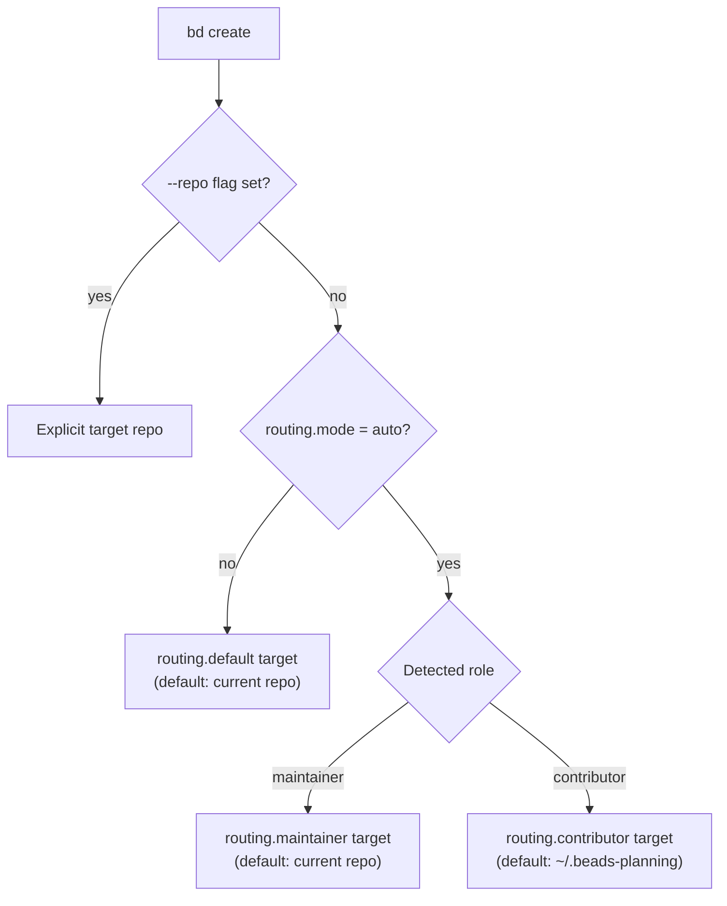

One agent often works across more than one repository: an OSS fork plus a
private planning repo, a planning repo feeding an implementation repo, several
project checkouts on one machine. **Routing** decides which repository's
database receives each new bead, so a contributor's planning never pollutes
upstream PRs while a maintainer's beads land straight in the project.

Routing is opt-in. With no routing configuration, every bead lands in the
current repository — nothing on this page changes single-repo workflows.

## The contributor problem

You fork an OSS project that uses beads. Every planning bead you create writes
to the fork's `.beads/` data, and your fork's issue database now diverges from
upstream in every PR you open. What you want is to plan freely *about* the
project without planning *in* the project.

Routing solves this by detecting your role and redirecting `bd create` to a
separate planning repository (`~/.beads-planning` by default) that is never
pushed upstream.

## How routing decides

When you run `bd create`, the target repository is chosen in strict
precedence order:

1. `--repo <path>` — explicit override, always wins
2. `routing.mode: auto` — route by detected role (maintainer or contributor)
3. `routing.default` — everything else (defaults to `.`, the current repo)



Reads follow the same routing: with routing active, `bd list` and `bd ready`
read from the routed repository, and ID lookups like `bd show` fall back to
the routed repository when a bead isn't found locally.

## Role detection

The role that drives auto mode comes from git config — `beads.role` is the
source of truth:

```bash
bd config set beads.role contributor   # stored in git config, not the database
bd config get beads.role
```

When `beads.role` is unset, `bd` prints a warning and falls back to a
deprecated remote-URL heuristic:

| Git remote situation | Detected role |
|---|---|
| `origin` and `upstream` point at different repos (fork workflow) | contributor |
| SSH `origin` (`git@...`, `ssh://`) or credentialed HTTPS | maintainer |
| Plain HTTPS `origin` without credentials | contributor |
| No remote configured (local project) | maintainer |

<Note>
SSH does not reliably indicate push access — fork contributors often clone
over SSH. Set `beads.role` explicitly and the heuristic (and its warning)
never runs.
</Note>

## Setup

### Contributors

```bash
cd ~/projects/my-fork
bd init --contributor
```

The interactive wizard:

1. Creates the planning repository (`~/.beads-planning` by default) as its
   own git repo with a `.beads/` directory
2. Sets `routing.mode: auto` and `routing.contributor` to the planning repo
3. Adds the planning repo to `repos.additional` so routed beads stay visible
   (see [hydration](#multi-repo-hydration))
4. On forks, points sync at the `upstream` remote so `bd dolt pull` fetches
   issue data from the source repo rather than your fork

Plain `bd init` also detects the fork pattern (an `upstream` remote that
differs from `origin`) and applies the same contributor configuration
automatically; pass `--role maintainer` to opt out.

If you created planning beads in the project database before configuring
routing, [`bd migrate-personal`](/cli-reference/migrate-personal) moves the
beads created by your git identity into your planning repo.

### Teams

```bash
bd init --team
```

Teams sharing one repository usually need no routing: with routing unset,
every bead lands in the shared repo. The team wizard configures the rest of
the shared workflow — team mode and, for protected-main setups, a separate
sync branch for issue commits. Team members who want a private scratch space
route experiments explicitly:

```bash
bd create "Try alternative approach" --repo ~/.beads-planning-personal
```

Full step-by-step walkthroughs for both scenarios (plus multi-phase and
multi-persona setups) live in
[Multi-Repo Migration](/multi-agent/multi-repo-migration).

## Configuration reference

Set these with `bd config set <key> <value>`; see the
[configuration reference](/reference/configuration) for storage locations.

| Key | Default | Meaning |
|---|---|---|
| `routing.mode` | (unset) | `auto` routes by role; `explicit` (or unset) sends everything to `routing.default` |
| `routing.default` | `.` | Target when auto mode is off |
| `routing.maintainer` | `.` | Target for maintainers in auto mode |
| `routing.contributor` | `~/.beads-planning` | Target for contributors in auto mode |
| `repos.primary` | (unset) | Primary repo for multi-repo hydration |
| `repos.additional` | (unset) | Repos to hydrate beads from |
| `beads.role` | (unset) | Explicit role: `maintainer` or `contributor` (stored in git config) |

Verify the effective configuration and where each value comes from:

```bash
bd config show            # all sources: config.yaml, database, git, env
bd config validate        # checks routing.mode value and related settings
bd where                  # which database this directory actually uses
```

## Overriding per bead

`--repo` bypasses routing entirely for one bead:

```bash
bd create "Fix upstream bug" --repo .              # force current repo
bd create "Private experiment" --repo ~/scratch    # force another repo
```

## Discovered work stays with its parent

A bead created with a `discovered-from` dependency inherits its parent's
`source_repo`, so work discovered while executing a task stays attributed to
the same repository as that task — regardless of your role:

```bash
bd create "Found race in auth" --deps discovered-from:bd-abc
# inherits bd-abc's source_repo
```

Add `--repo` to override the inheritance.

## Multi-repo hydration

Routing writes beads to another repository — which means your current
database doesn't contain them. **Hydration** imports beads from other repos
into your database, each tagged with its `source_repo`, so `bd list` and
`bd ready` show one unified view.

Configure it by listing the other repos in `repos.additional`:

```bash
bd repo add ~/.beads-planning    # add a repo to hydrate from
bd repo list                     # show primary + additional repos
bd repo sync                     # import beads from all additional repos
bd repo remove ~/.beads-planning # remove, deleting its hydrated beads
```

`bd repo sync` reads each additional repo's `.beads/issues.jsonl` export and
imports the beads with their original prefixes and `source_repo` set,
skipping repos whose export hasn't changed. `bd init --contributor` wires
hydration up automatically; `bd doctor` warns when routing targets are
missing from `repos.additional`.

Once hydrated, beads from other repos are ordinary rows in your database —
filter by provenance or link them with normal dependencies:

```bash
bd list --json | jq '.[] | select(.source_repo == "~/.beads-planning")'
bd dep add impl-42 plan-10 --type blocks
```

For dependencies on *capabilities* of another project rather than specific
beads, `bd dep add` also accepts `external:<project>:<capability>` targets —
see [`bd dep`](/cli-reference/dep).

## One agent, many projects

An AI agent working across several repositories should run a *single* beads
MCP server instance:

```json
{
  "beads": {
    "command": "beads-mcp",
    "args": []
  }
}
```

The server resolves the beads workspace from each request's working
directory, so one configuration serves every project while each project keeps
its own isolated database (embedded Dolt at `.beads/embeddeddolt/` by
default; server mode uses `.beads/dolt/`). Running one MCP instance per
project invites operations landing in the wrong database.

To share one Dolt server across all projects instead of embedded per-project
storage, initialize with `bd init --shared-server` (or set
`BEADS_DOLT_SHARED_SERVER=1`): projects share a server at
`~/.beads/shared-server/` while staying isolated in per-project databases
named after their issue prefixes. See [MCP Server](/integrations/mcp-server)
for installation and client configuration.

## Troubleshooting

### Beads land in the wrong repository

```bash
bd config get routing.mode         # auto?
bd config get beads.role           # explicit role set?
bd config show --source git        # what git config contributes
```

Fix by setting the role explicitly (`bd config set beads.role maintainer`),
forcing the target for one bead (`--repo .`), or disabling role detection
entirely (`bd config set routing.mode explicit`).

### Routed beads don't appear in bd list

The routing target isn't being hydrated. Add it and sync:

```bash
bd repo add ~/.beads-planning
bd repo sync
```

`bd doctor` catches this misconfiguration.

### Discovered beads appear in the "wrong" repo

Intentional — beads with a `discovered-from` dependency inherit the parent's
`source_repo`. Override with `--repo` at creation time.

### Planning beads show up in upstream PRs

The planning repo must be a separate git repository, never committed to the
fork:

```bash
ls ~/.beads-planning/.git              # should exist
bd config get routing.contributor      # should point at the planning repo
```

### Role warning on every bd create

`bd` warns when it falls back to the URL heuristic. Silence it permanently:

```bash
bd config set beads.role maintainer    # or contributor
```

## Related pages

- [Multi-Repo Migration](/multi-agent/multi-repo-migration) — full setup
  walkthroughs for contributor, team, and multi-phase workflows
- [Agent Coordination](/multi-agent/coordination) — assigning and claiming
  work between agents
- [Federation](/multi-agent/federation) — peer-to-peer sharing of beads
  across repos and organizations
- [`bd init`](/cli-reference/init), [`bd config`](/cli-reference/config),
  [`bd repo`](/cli-reference/repo), [`bd create`](/cli-reference/create) —
  command reference
