# Architecture Overview

This document explains how Beads' architecture works with Dolt as its storage backend.

## Architecture

Beads uses **Dolt** as its sole storage backend -- a version-controlled SQL database that provides git-like semantics (branch, merge, diff, push, pull) natively at the database level.

```mermaid
flowchart TD
    subgraph DOLT["🗄️ Dolt Database"]
        D[(".beads/dolt/<br/><i>Version-Controlled SQL</i>")]
    end

    subgraph REMOTE["🌐 Dolt Remotes"]
        R[("DoltHub / S3 / GCS<br/><i>Sync & Backup</i>")]
    end

    D <-->|"bd dolt push/pull"| R

    U((User)) -->|"bd create<br/>bd update"| D
    D -->|"bd list<br/>bd show"| U

    style DOLT fill:#2d5a27,stroke:#4a9c3e,color:#fff
    style REMOTE fill:#1a4a6e,stroke:#3a8ac4,color:#fff
```



:::info Source of Truth
**Dolt** is the source of truth. Every write auto-commits to Dolt history, providing full version control, branching, and merge capabilities at the database level.

Recovery is straightforward: pull from a Dolt remote, or use `bd import` to load from a JSONL backup.
:::

### Why Dolt?

- **Version-controlled SQL**: Full SQL queries with native version control
- **Cell-level merge**: Concurrent changes merge automatically at the field level
- **Multi-writer**: Server mode supports concurrent agents
- **Native branching**: Dolt branches independent of git branches
- **Works offline**: All queries run against local database
- **Portable**: `bd export` produces JSONL for migration and interoperability

## Data Flow

### Write Path
```text
User runs bd create
    → Dolt database updated
    → Auto-committed to Dolt history
```

### Read Path
```text
User runs bd list
    → Dolt SQL query
    → Results returned immediately
```

### Sync Path
```text
User runs bd dolt push
    → Commits pushed to Dolt remote

User runs bd dolt pull
    → Remote commits fetched and merged
```

### Multi-Machine Sync Considerations

When working across multiple machines or clones:

1. **Always sync before switching machines**
   ```bash
   bd dolt push  # Push changes before leaving
   ```

2. **Pull before creating new issues**
   ```bash
   bd dolt pull  # Pull changes first on new machine
   bd create "New issue"
   ```

3. **Avoid parallel edits** - If two machines create issues simultaneously without syncing, Dolt's cell-level merge handles most conflicts automatically

See [Sync Failures Recovery](/recovery/sync-failures) for data loss prevention in multi-machine workflows (Pattern A5/C3).

## Dolt Server Mode

The Dolt server handles background synchronization and database operations:

- Manages the Dolt database backend
- Handles auto-commit for change tracking
- Provides concurrent access for multiple agents
- Logs available at `.beads/dolt/sql-server.log`

:::tip
Start the Dolt server with `bd dolt start`. Check health with `bd doctor`.
:::

### Embedded Mode (No Server)

For CI/CD pipelines, containers, and single-use scenarios, no server is needed. Beads operates in embedded mode automatically when no Dolt server is running:

```bash
bd create "CI-generated issue"
bd sync
```

**When embedded mode is appropriate:**
- CI/CD pipelines (Jenkins, GitHub Actions)
- Docker containers
- Ephemeral environments
- Scripts that should not leave background processes

### Multi-Clone Scenarios

:::warning Race Conditions in Multi-Clone Workflows
When multiple git clones of the same repository run sync operations simultaneously, race conditions can occur during push/pull operations. This is particularly common in:
- Multi-agent AI workflows (multiple Claude/GPT instances)
- Developer workstations with multiple checkouts
- Worktree-based development workflows

**Prevention:**
1. Stop the Dolt server (`bd dolt stop`) before switching between clones
2. Dolt handles worktrees natively in server mode
3. Use embedded mode for automated workflows
:::

See [Sync Failures Recovery](/recovery/sync-failures) for sync race condition troubleshooting (Pattern B2).

## Recovery Model

Dolt's version control makes recovery straightforward:

1. **Lost database?** → Pull from Dolt remote: `bd dolt pull`
2. **Have a JSONL backup?** → Import it: `bd import -i backup.jsonl`
3. **Merge conflicts?** → Dolt handles cell-level merge natively

### Universal Recovery Sequence

The following sequence resolves the majority of reported issues. For detailed procedures, see [Recovery Runbooks](/recovery).

```bash
bd dolt stop                 # Stop Dolt server (prevents race conditions)
git worktree prune           # Clean orphaned worktrees
bd dolt pull                 # Pull from Dolt remote
bd dolt start                # Restart server
```

:::warning Use `bd doctor --fix` With Care
Always back up and preview before running `bd doctor --fix`:

1. **Back up first:** `cp -r .beads .beads.backup`
2. **Preview changes:** `bd doctor --dry-run` — shows what would be fixed without making changes
3. **Review diagnostics:** `bd doctor` (no flags) — diagnostic only, no changes made
4. **Then fix:** `bd doctor --fix` — or `bd doctor --fix -i` to confirm each fix individually

**Why caution?** The `--fix` flag may remove dependencies it flags as circular, including valid parent-child relationships. Use `--fix-child-parent` only if you're certain the flagged deps are invalid.

**Other diagnostic tools:**
- `bd blocked` — check which issues are blocked and why
- `bd show <issue-id>` — inspect a specific issue's state
:::

See [Recovery](/recovery) for specific procedures and [Database Corruption Recovery](/recovery/database-corruption) for Dolt recovery steps.

## Design Decisions

### Why Dolt?

Dolt is a version-controlled SQL database that provides git-like semantics natively. Unlike plain SQLite (binary merge conflicts) or JSONL (slow queries), Dolt gives you both fast SQL queries and proper merge semantics.

### Why not a cloud server?

Beads is designed for offline-first, local-first development. The Dolt server runs locally -- no cloud dependency, no downtime, no vendor lock-in, and full functionality on airplanes or in restricted networks.

### Trade-offs

| Benefit | Trade-off |
|---------|-----------|
| Works offline | No real-time collaboration |
| Version-controlled database | Requires Dolt server |
| Cell-level merge | Requires initial setup |
| Local-first speed | Manual sync to remotes |
| SQL queries | Dolt binary dependency |

### When NOT to use Beads

Beads is not suitable for:

- **Large teams (10+)** — Git-based sync doesn't scale well for high-frequency concurrent edits
- **Non-developers** — Requires Git and command-line familiarity
- **Real-time collaboration** — No live updates; requires explicit sync
- **Cross-repository tracking** — Issues are scoped to a single repository
- **Rich media attachments** — Designed for text-based issue tracking

For these use cases, consider GitHub Issues, Linear, or Jira.

## Related Documentation

- [Recovery Runbooks](/recovery) — Step-by-step procedures for common issues
- [CLI Reference](/cli-reference) — Complete command documentation
- [Getting Started](/) — Installation and first steps
